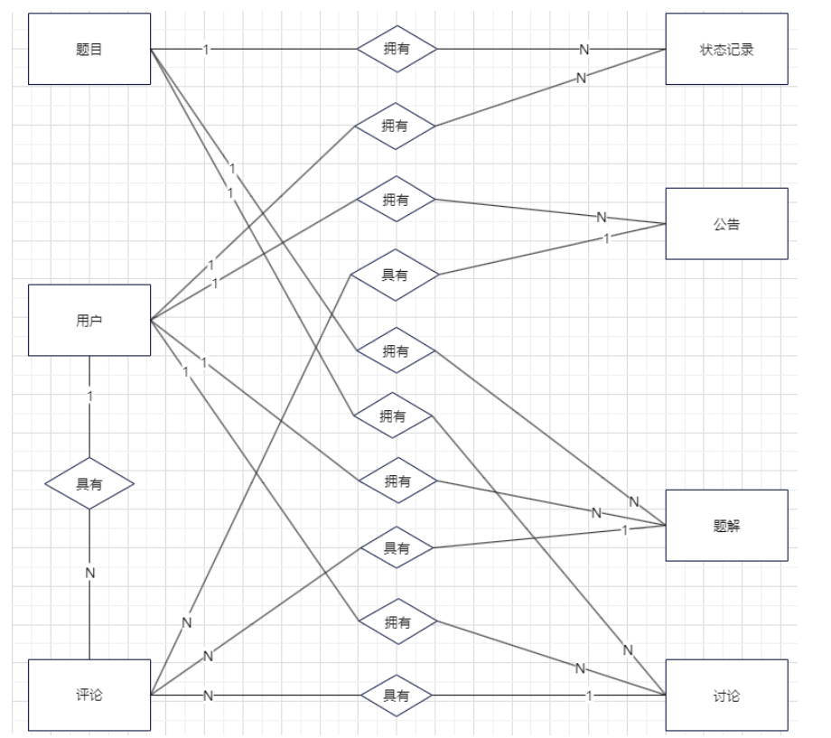

# 数据库表设计

根据需求分析，OJ 系统的主要实体包括：用户、题目、状态记录、公告、讨论、题解、评论。

本项目采用MondDB作为数据库，它是一个非关系型数据库。
默认情况下，在集合中插入文档时，如果字段名中没有_id 的字段名称，则 MongoDB 将自动添加一个 ObjectId 字段并且会设置为主键，在本项目中我们自定义_id 字段为 int64_t 类型。

1.User（用户表）
{
  "_id": "int64_t", // ID
  "Avatar": "string", // 头像
  "NickName": "string", // 昵称
  "Account": "string", // 账号
  "PassWord": "string", // 密码
  "PersonalProfile": "string", // 个人简介
  "School": "string", // 学校
  "Major": "string", // 专业
  "JoinTime": "string", // 加入时间
  "CommentLikes": [
    // 点赞列表
    "string"
  ],
  "Solves": [
    // 解决题目列表
    "int64_t"
  ],
  "ACNum": "int", // AC次数
  "SubmitNum": "int", // 提交次数
  "Authority": "int" // 权限
}

2.Problem（题目表）
{
  "_id": "int64_t", // ID
  "Title": "string", // 标题
  "Description": "string", // 内容
  "JudgeNum": "int", // 测试点数量
  "SubmitNum": "int", // 提交次数
  "CENum": "int", // Compile Error次数
  "ACNum": "int", // Accepted次数
  "WANum": "int", // Wrong Answer次数
  "RENum": "int", // Runtime Error次数
  "TLENum": "int", // Time Limit Exceed次数
  "MLENum": "int", // Memory Limit Exceed次数
  "SENum": "int", // System Error次数
  "UserNickName": "string", // 用户昵称
  "Tags": [
    // 标签列表
    "string"
  ]
}

3.StatusRecord（状态记录表）
{
  "_id": "int64_t", // ID
  "ProblemId": "int64_t", // 题目ID
  "UserId": "int64_t", // 用户ID
  "UserNickName": "string", // 用户昵称
  "ProblemTitle": "string", // 题目标题
  "Status": "int", // 状态
  "RunTime": "string", // 运行时间
  "RunMemory": "string", // 运行内存
  "Length": "string", // 代码长度
  "Language": "string", // 语言
  "SubmitTime": "string", // 提交时间
  "Code": "string", // 代码
  "CompilerInfo": "string", // 编译器信息
  "TestInfo": [
    // 测试点详情列表
    {
      "Status": "int", // 状态
      "StandardInput": "string", // 标准输入
      "StandardOutput": "string", // 标准输出
      "PersonalOutput": "string", // 用户输出
      "RunTime": "string", // 运行时间
      "RunMemory": "string" // 运行内存
    }
  ]
}

4.Announcement（公告表）
{
  "_id": "int64_t", // ID
  "Title": "string", // 标题
  "Content": "string", // 内容
  "UserId": "int64_t", // 用户ID
  "Views": "int", // 浏览量
  "Comments": "int", // 评论数
  "Level": "int", // 重要等级
  "CreateTime": "time", // 创建时间
  "UpdateTime": "time" // 修改时间
}

5.Discuss（讨论表）
{
  "_id": "int64_t", // ID
  "Title": "string", // 标题
  "Content": "string", // 内容
  "ParentId": "int64_t", // 父ID(0或者题目ID)
  "UserId": "int64_t", // 用户ID
  "Views": "int", // 浏览量
  "Comments": "int", // 评论数
  "CreateTime": "time", // 创建时间
  "UpdateTime": "time" // 修改时间
}

6.Solution（题解表）
{
  "_id": "int64_t", // ID
  "Title": "string", // 标题
  "ParentId": "int64_t", // 父ID(题目ID)
  "Content": "string", // 内容
  "UserId": "int64_t", // 用户ID
  "Views": "int", // 浏览量
  "Comments": "int", // 评论数
  "CreateTime": "time", // 创建时间
  "Public": "bool", // 是否公开
  "UpdateTime": "time" // 修改时间
}

7.Comment（评论表）
{
  "_id": "int64_t", // ID
  "ParentId": "int64_t", // 父ID(公告ID、讨论ID、题解ID)
  "ParentType": "string", // 父类型
  "Content": "string", // 内容
  "UserId": "int64_t", // 用户ID
  "Likes": "int", // 点赞数
  "CreateTime": "time", // 创建时间
  "Child_Comments": [
    // 子评论列表
    {
      "_id": "int64_t", // ID
      "Content": "string", // 内容
      "UserId": "int64_t", // 用户ID
      "Likes": "int", // 点赞数
      "CreateTime": "time" // 创建时间
    }
  ]
}
